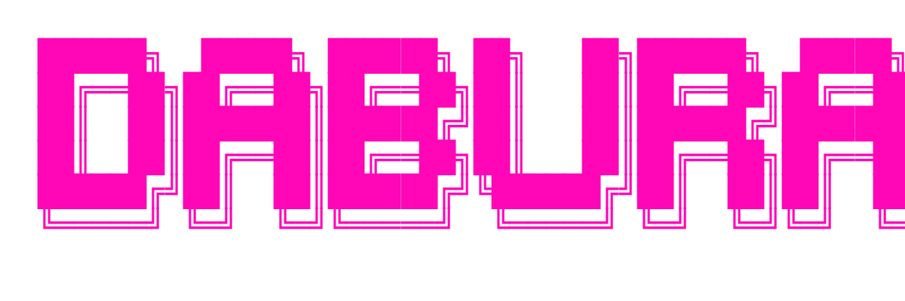

<p align="center">
  
</p>

# DABURA v1.0.0


**Dabura** es una potente TUI (Terminal User Interface) escrita en Go para buscar y gestionar contenido multimedia desde la terminal. Olvidate de la publicidad molesta y navegá tus servicios favoritos con estilo.

---

## Instalación

###  Linux
Copiá y pegá esto en tu terminal:
```bash
curl -sSL https://raw.githubusercontent.com/NewKeyth/kill-dabura/main/install.sh | bash
```

### Windows (PowerShell)
Ejecutá esto como administrador:
```powershell
iwr https://raw.githubusercontent.com/NewKeyth/kill-dabura/main/install.ps1 | iex
```

---

##  Características
-  **Ultra Rápido**: Escrito en Go para un rendimiento máximo.
-  **Interfaz Pro**: Desarrollado con Bubble Tea para una experiencia visual increíble en la terminal.
-  **Multiplataforma**: Funciona exactamente igual en Windows y Linux.
-  **Limpio**: Sin archivos basura, solo lo que necesitás.

---

[NewKeyth](https://github.com/NewKeyth)
